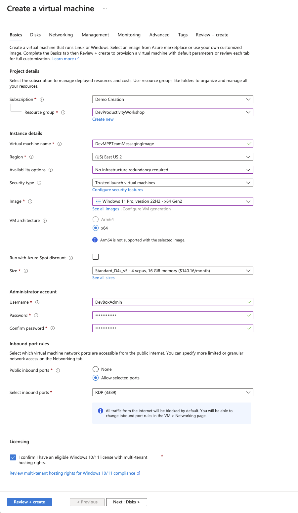

# Task 02 - Setup an image (90 minutes)

1. In the Azure Portal create a new Azure Compute Gallery
   
2. Configure the following properties. On the Sharing Tab you can keep the defaults. Create the Gallery.
   ![Compute Gallery Configuration]../Media/ComputerGalleryBasics.png)
3. Now creating a Windows 11 VM
4. 
5. For the settings
    - Basics:
      - Same Resource Group you've been using
      - Virtual Machine name: DevMPPTeamMessagingImage
      - Availability options: No infrastructure redundancy required
      - Security type: Trusted launch virtual machines
      - Images: Windows 11 Enterprise, version 22H2 - x64 Gen2
        - **Note: Make sure you select enterprise and not pro. Pro is not supported for Dev Box.** 
      - Size: Standard_D4s_v5
      - Username: DevBoxAdmin
      - Password: something you'll remember
      - Licensing: Confirm
        
    - Disks:
      - Do nothing
    - Networking:
      - Make sure it's connected to the network you created in the last task
      - Check "Delete public IP and NIC when a VM is deleted":
      - Uncheck "Enable accelerated network"
        
    - Management, Monitoring, Advanced
      - Do nothing and take the defaults
    - Create the VM
6. Configure the network to only allow RDP access form you IP address
    - Under the VM Network settings click RDP in the Network Security Group. Set Source to "My IP address" and select Save
    
7. RDP Into the box and download/install the software.
   1. These are all pretty straight forward, just make sure they all get installed for all users
   2. Before running sysprep, shut down the VM and take a snapshot. Once you perform a sysprep you can't start the VM back up again without using this snapshot.
   3. An error with Docker after the install is fine, just ignore it and do the sysprep
8. After the Windows machine shuts down due to sysprep, navigate to your virtual machine in Azure.
9. Select Capture
    
10. Select the Azure computer gallery you created in Task 1
    
11. Create a new Target VM image definition
    
12. Set the Version number to 1.0.0
13. Set Default storage SKU to Premium SSD LRS
14. The configuration should look like this. Then create the image
    
    -**Note**: This step can take some time to complete. If it hasn't completely after about 20 minute, students can proceed to Exercise 2 and use their own machines. They can check on that status periodically, and once it completes, move on to Task 3. It's OK to use their own machine for Day 1 and use the Dev Box on day 2.
